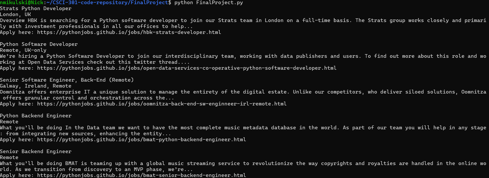

[Back to Portfolio](./)

HTML Job Webscraper
===============

-   **Class: CSCI-301** 
-   **Grade: 100%** 
-   **Language(s): Python** 
-   **Source Code Repository:** [Nickam147/Portfolio-CSCI301-Project](https://github.com/Nickam147/Portfolio-CSCI301-Project)  
    (Please [email me](mailto:namikulski@student.csuniv.edu?subject=GitHub%20Access) to request access.)

## Project description

This project is a Python-based web scraper designed to extract job listing content from a public HTML job board website. This project uses the libraries "requests" and "BeautifulSoup" to extract the contents and parse HTML content, then display the relevant job titles and descriptions for the user to view.

## How to compile and run the program

```bash
cd /projectlocation
./webscraper
```

## UI Design

This project is a command line designed program made to be used with a Linux-based terminal to correctly run. The UI is text-based and outputs job listing information in a neat structured format directly to the console.

  
Fig 1. The example website used to webscrape and parse HTML from.

  
Fig 2. Example output after input is processed.

For more details see [GitHub Flavored Markdown](https://guides.github.com/features/mastering-markdown/).

[Back to Portfolio](./)