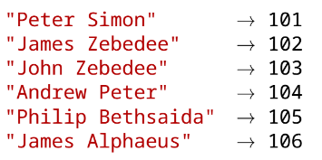
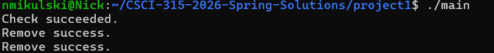

[Back to Portfolio](./)

Large Map with Fast Prefix Matching
===============

-   **Class: CSCI-315** 
-   **Grade: 95%** 
-   **Language(s): C++** 
-   **Source Code Repository:** [Nickam147/Portfolio-CSCI315-Project](https://github.com/Nickam147/Portfolio-CSCI315-Project)  
    (Please [email me](mailto:namikulski@student.csuniv.edu?subject=GitHub%20Access) to request access.)

## Project description

This is a C++ based project that implements a memory and performance-efficient Map that
associates student first and last names from independent text files with unique integer IDs with the use of a dynamically allocated array to manage the students.

## How to compile and run the program

How to run the project.

```bash
cd /projectlocation
./prefixmatch
```

## UI Design

This project is a command line designed program made to be used with a Linux-based terminal to correctly run. The UI is text-based and simply outputs if the checks succeeded in a neat structured format directly to the console.

  
Fig 1. An example of how the Map assigns unique integer IDs to different student names.

  
Fig 2. Example output after input is processed.

For more details see [GitHub Flavored Markdown](https://guides.github.com/features/mastering-markdown/).

[Back to Portfolio](./)