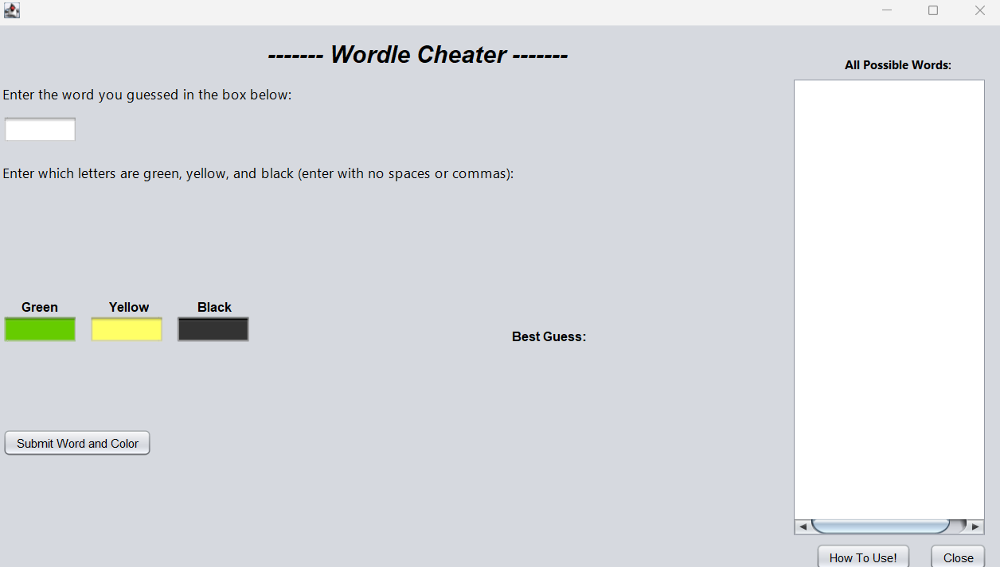
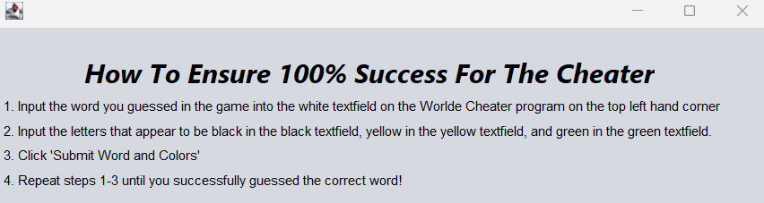
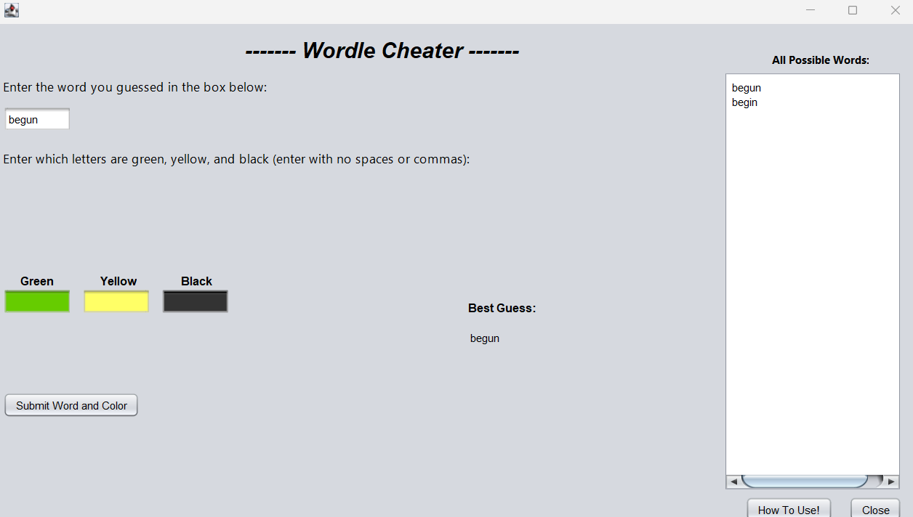
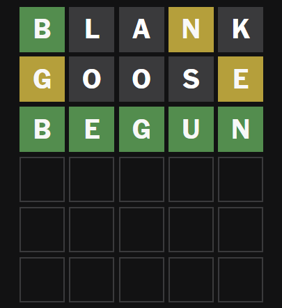

[Back to Portfolio](./)

Wordle Cheater
===============

-   **Class: CSCI-325** 
-   **Grade: 92%** 
-   **Language(s): Java** 
-   **Source Code Repository:** [Nickam147/Portfolio-CSCI315-Project](https://github.com/Nickam147/Portfolio-CSCI325-Project)  
    (Please [email me](mailto:namikulski@student.csuniv.edu?subject=GitHub%20Access) to request access.)

## Project description

This is a GUI Java based project created alongside four (4) other classmates/collaborators, to help users guess the daily word for the popular game "Wordle" by the New York Times. This is a project done with GUI that gives users an easy-to-read interactive UI to help them guess the daily word, alongside a description box to guide users on how to use the program.

## How to compile and run the program

Be sure to install Java, and run the .jar executable.

## UI Design

This project is a GUI designed program made with the help of Apache Netbeans. The UI was designed to be a simple and understandable tool used to help cheat in the game wordle. Users are able to input the first word they guessed in the game and report which letters specifically are green (correct), yellow (found in the word), or black (not found in the word). An additional "How to use" button prompts users with another tab on how to use the program if such confusion arises.

  
Fig 1. The program GUI itself.

  
Fig 2. The program GUI for the "How to use" button.

  
Fig 3. How the program GUI looks when used.

  
Fig 4. The example Wordle game outcome.

For more details see [GitHub Flavored Markdown](https://guides.github.com/features/mastering-markdown/).

[Back to Portfolio](./)