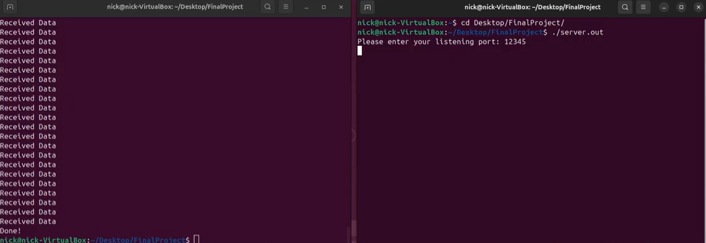
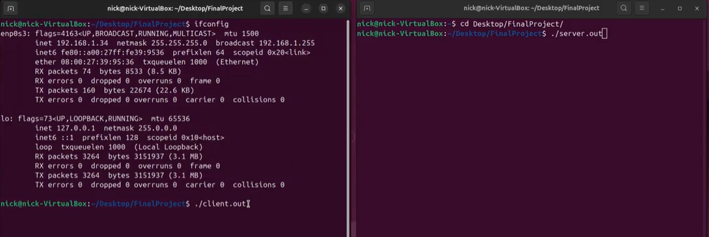
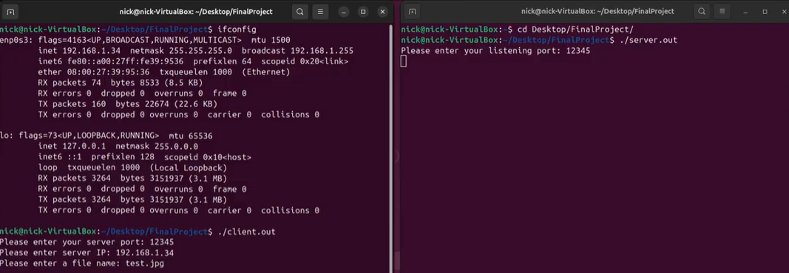
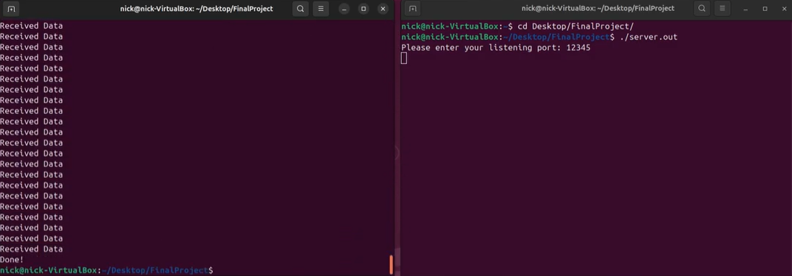

[Back to Portfolio](./)

AirDrop Data Transfer
===============

-   **Class: CSCI 332** 
-   **Grade: 100%** 
-   **Language(s): C++** 
-   **Source Code Repository:** [Nickam147/Portfolio-CSCI332-Project](https://github.com/Nickam147/Portfolio-CSCI332-Project)  
    (Please [email me](mailto:namikulski@student.csuniv.edu?subject=GitHub%20Access) to request access.)

## Project description

This project was constructed to replicate how Apple products like iPhones and Mac computers are able to transfer files between devices through networking. This project was done in C++ in pairs of two, and the main objective was to transfer an image file from one machine to another through LAN.

## How to compile and run the program

To run the program, open two Linux terminals, run ./client.out on one terminal, and
./server.out on the other terminal and follow instructions on both terminals.
[Press here for a video demonstration](https://www.youtube.com/watch?v=XgYJRq8rg34)

## UI Design

This project is a command line designed program made to be used with two Linux-based terminals to correctly run. The UI is text-based and asks the user for inputs such as listening ports, active server IP address, and a file name for transfer. When done, the terminal will display "Done!" when finished or an error message if file was not found or typed incorrectly.

  
Fig 1. The command line terminals setup.

  
Fig 2. How to properly run the files.

  
Fig 3. The example listening ports, server IP, and file name.

  
Fig 4. A successful output meaning the file was transfered.

For more details see [GitHub Flavored Markdown](https://guides.github.com/features/mastering-markdown/).

[Back to Portfolio](./)